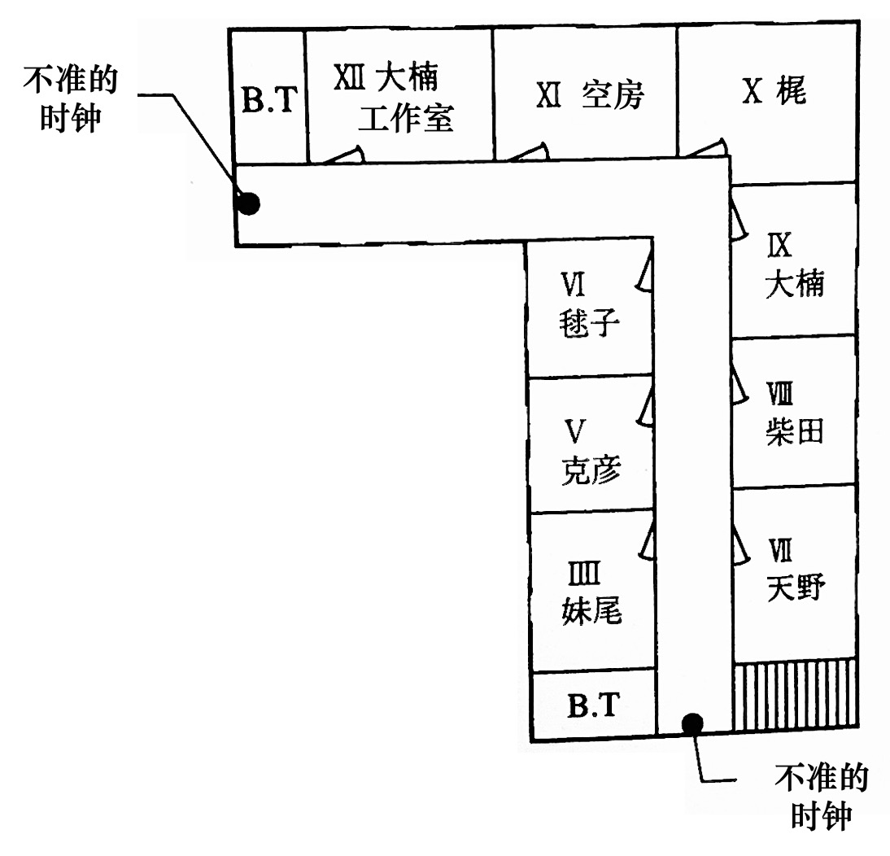

<html>
    <head>
        
    </head>
<body>

 『時鐘館の殺人』（今邑彩·1993）

 

> 本文为<a href="https://book.douban.com/subject/10809297/"><b>「<ruby>時鐘<rt>とけい</rt></ruby>館の殺人」</b></a>标题作的翻译。原文版权归作者与出版社所有，翻译仅供学习交流，转载请注明出处，禁止用于商业用途。

 

    

        
<a href="https://book.douban.com/subject/10809297/"><b>内容简介</b></a>

    

    

        

            
        

        

            
集结了包括作家、评论家在内的推理爱好者寄宿舍——时钟馆。在编辑催稿前夕，年迈的推理小说家留下“原稿一页未写。恕我任性‘消失’。”这样一封信后便杳无踪影。翌日清晨，他的尸体被发现藏于雪人之中……这群推理迷会如何展开华丽而严谨的推理？
               本文为短篇小说集《时钟馆事件》标题作，另收录「<a href="https://www.douban.com/note/851063386/?_i=8456568Sh6fRcN,8800039rKyl-MY"><b>行尸杀人事件</b></a>」·「<a href="https://www.douban.com/note/851062371/?_i=8455486Sh6fRcN,8800378rKyl-MY"><b>黑白的反转</b></a>」·「<a href="https://www.douban.com/group/topic/94158122/?_i=8455005Sh6fRcN,8800400rKyl-MY"><b>邻家杀人事件</b></a>」·「<a href="https://www.douban.com/note/856022725/?_i=0218283rKyl-MY"><b>那孩子乃何人</b></a>」·「<a href="https://www.douban.com/note/851061997/?_i=8455207Sh6fRcN,8800453rKyl-MY"><b>恋人啊</b></a>」5篇作品。

             
        

    

 

## 序幕

电话铃响了。

在铃声响起之前，它发出了一个吸气般微弱的声音，我心想“有电话吗”，便往旁边瞄了一眼，果不其然。我咂了咂嘴，把手从文字处理器的键盘上移开，躺了下来。趴到榻榻米上后，用力伸一伸右手就能够到电话。

时值二月。窗外的庭院中，积雪消融，梅花盛开。我正把文字处理器放在被炉上，急速而有点焦躁地敲击着键盘。

出道已经三个月了。在这个随便扔块石头都有可能砸到一位推理小说家的时代，出道倒是简单，但问题在于出道之后。容易出道意味着竞争率也随之提高。一不留神，我的命运就会像那窗外的雪一般，被轻易地扫到角落、悄无声息地泯灭。我可不想如一阵疾风般出现又如一阵疾风般消逝。为此，我必须尽快完成第二部作品。但我却写不出来。这也是常有的事。

负责我处女作的编辑时常毫不客气地对我说什么“第二部作品至关重要。能否留住读者全都取决于第二部作品的质量”这种既像鼓励又像警告的话。如果有新人能在这样的“鼓励”下轻松写出杰作的话，那我真想见见这位。毫无疑问，绝对是天才。

必须尽快完成第二部作品也是出于经济上的考虑。处女作的版税早就花完了。由于是在没有明确未来规划的情况下成为了全职作家，在第二部作品的版税到账前，我都是不折不扣的无收入者。

这种不稳定状态真是让人忍俊不禁。

也许这通电话是关于赚钱的事情？听起来很欢快的电话铃声让我有了这样的预感。发大财！我这么祈祷着，躺着接了电话。

“喂，您好？”

“请问是今邑小姐家吗？”

陌生的男声。既然他提到的是我的笔名，多半是出版社的相关人士。万岁！看来是能赚到钱钱的事情。不过，现在高兴还为时尚早，不能排除只是一个简单的电话采访的可能性。

“是的，我就是。”

虽然我这样想，但还是情不自禁地提高了声音。我赶紧在榻榻米上正襟危坐。一直躺着的话，福神可是会溜走的。

“我是QED的××。”

QED？啊啊《QED》啊，与《Mystery Magazine》和《EQ》齐名的专业推理杂志。

“我是贵刊的忠实读者。”

我立刻开始奉承他。不过这并非完全的谎言。这本名为《QED》的月刊杂志非常本格，我也确实经常阅读。

“那可真是感激不尽。”

对方的声音中突然透露出了笑意，关系似乎也拉近了不少。阿谀奉承在人际关系中实在不可或缺。

“那您知道我们杂志有一个推理凶手的谜题小说专栏吧。”

“当然知道！我还投稿过呢。”

《QED》中设置了一个经典的“挑战读者”专栏。他们请已经出名的推理作家出题，然后让读者来猜凶手，猜对的读者就会得到奖金。尽管这不算什么新点子，但作为一个强调本格推理的杂志，它的投稿规则非常之严格，不是那种在明信片上随手写下犯人的名字，便能寄希望于通过抽签来获奖的机制，而是必须在八百字以内、逻辑清晰地论述认定此人为凶手的根据。与之相对，如果有多位读者给出了正确答案，他们也不会随随便便地通过抽签来决定获奖者，而是会由编辑部选择一个论据最为完备的答案，奖励五万日元。

“真是非常感谢。那就方便说明了，我们迫切希望您能作为出题者参与这个专栏。”

噢耶—— 果然是能够赚到钱的事。正巧，我手头有一篇存货，是一个共三百五十页的长篇小说。我之前把它投给了某个奖，但不幸落选，正当我失望之际，稿子又出乎意料地被一家出版社捡走。本来出版社告诉我稍作修改就能出书，但最后还是惨遭退稿，空欢喜一场。

这部作品的谜题性非常不错，看来它终于能派上用场了。真是三度出嫁之作啊。

“请让我来做！我手头有稿子。”

“这样啊。那按每页400字来算，请确保问题篇和解答篇加起来不超过一百页。”

编辑以一种理所应当而又公事公办的语气回答道。

“但我的稿子有三百五十页。”

“那个，我是说，不超过一百页。”

编辑顿了一下，冷淡地回应道。

“我可以努力缩减到两百页。”

“不超过一百页。”

“我尽可能控制在一百五十页。”

“不超过一百页。”

“如果将其压缩到一百页，内容就会变得超级浓缩的。”

“内容浓缩是好事，读者爱看。”

“但过分浓缩的话呢？就像咖啡一样，过浓的咖啡据说可是会引发胃癌的。”

“读一本浓缩推理小说可不会引发胃癌。”

“但是，所谓过犹不及……”

“总之，请务必控制在一百页之内。”

编辑带着明显的不悦之情，毫不客气地说道。看起来完全没有妥协的余地。我意识到再争论下去也毫无意义。吆喝原稿就到此为止吧，再讨价还价的话可能会适得其反，最后落得“请当此事从未发生过”的境地。

“那好吧，我会控制在一百页以内。”

我极不情愿地答应了，以不会让他听到的音量悄悄地叹了口气。

“那么，请不要超过一百页。”编辑再次强调了一遍、告知了截稿日期，便挂断了电话。

我放下电话，忙不迭地掏出计算器。虽然忘了问他每一页的稿费是多少（居然忘了问最重要的事！）但就算我是新人作家，每页一千日元的价格也实在是不人道。我早早地打起了如意算盘：不清楚新人的市场价是多少，不过应该差不多有这个数吧。虽说，这点钱真的没必要专门拿出计算器来算……

话说回来，能确定好退稿的销路固然可喜可贺，但居然还得再删掉二百五十页。就算把内容精炼好了，对于作者来说也实在是残忍啊。噫吁嚱。

 

## 时钟馆事件·问题篇

 

    

        其角椟为橡，配之茶色框。 藏于寒壁内，封于棺之中。 其为时之骨，嗄吱声不断。  &nbsp; &nbsp; &nbsp; &nbsp; &nbsp;&nbsp;&nbsp; &nbsp; &nbsp; &nbsp;此乃时钟之惧也。
           
        ——摘自 上田敏译《海潮音》之 &nbsp; &nbsp; &nbsp;&nbsp; &nbsp; &nbsp&nbsp; &nbsp; &nbsp埃米尔·维尔哈伦《时钟》
    

 

### 1

时钟馆。

它像一座孤岛，漂浮在名为东京的混凝土海洋中。

透过浓绿色树木的间隙，便可看到这座拥有着陡峭屋脊与褪色红砖的西洋古宅。对于那些日复一日被困在高层建筑中的人来说，这童话般梦幻的外观无疑是抚慰疲惫双目的良方。

宅邸的主人名为樱井彻男，年逾花甲。他从大型食品公司退休后，与妻子敏江一起生活。若追根溯源，战前樱井家乃华族之家。尽管如今家产仅余此宅邸，但从先生那波浪般的银发、端正的面容到淡定的气度，无一不流露出贵族后裔的独特风范。

樱井氏是一位狂热的钟表爱好者，馆内的客厅摆满了他闲暇时收集的古老时钟。然而，其中鲜有珍品或价值不菲的舶来品，反而多为过去家家户户都有的八角时钟等庶民物件。称得上珍贵的只有摆在客厅一角的橹时钟，即大名时钟：这是江户时代的大名们命人仿照德国挂钟的结构，花费数日制作而成的。再就是香时钟还算珍奇，这是用灰作底、香作线，通过燃烧情况来计时的一种风雅之物。

至于“时钟馆”其名，据说是取自樱井氏钟爱的诗集《海潮音》中，由埃米尔·维尔哈伦所著的《时钟》一诗。

不过，最为独特的是，时钟馆内的钟都被有意地调错了时间，没有一个指向正确的时刻，甚至不乏早已停止运转的时钟。这是因为宅邸的主人是一位纯粹的自由主义者。据他所说，看着不计其数的指针指向同一方向无异于观看军队行进，这光景会让他感到生理性厌恶。樱井氏的左腿留有残疾，行走时明显地拖着腿。这是那场令人厌恶的战争的后遗症。

对于我们而言“不准”的旧时钟，在樱井氏看来却是“活在自己的时间里”。他们是从“告知正确时刻”这乏味的任务中永远解放出来的可敬老物件。对于膝下无子又不养宠物的樱井氏来说，这些钟就是他倾注全部心力的唯一对象。对他而言，忘记给钟表上发条无异于忘记给宠物喂食。

栖息于这终焉之地的各式时钟仿佛有了生命一般，无论何时都能听到不知从何而来的钟声。有的钟声显得谨小慎微，有的则悠然自得，还有的像老人深沉的叹息。

说起来，樱井氏本打算退休后与他心爱的旧时钟相伴，宁静地了此余生。可惜他的妻子敏江不同意丈夫这种奢侈行为。在她看来，让十几个房间白白地空着实在是太浪费了，就算是为了保证退休后的生活质量，也应该开放二楼，招揽租客。

尽管樱井氏强烈反对这个不得了的想法，但最终还是屈服于妻子的雄辩，不得不发布征集租客的广告。然而，当他见到了那位被广告吸引来的租客时，樱井氏的立场立刻发生了180度的大转变，对这个招募租客的主意点头称是。

那个人物便是名为大楠润也的46岁推理小说家。可能很多人压根不知道大楠润也为何方神圣，毕竟他既不是经常出现在广告或杂志封面上的热门作家，也不是那种会被称为推理小说界的大师或巨匠的那种类型。硬要说的话，他更像是推理小说界的异兽。如果不是推理小说（更确切地说，那种聚焦于解谜和诡计的侦探小说）的狂热粉丝，否则可能听都没听过这个名字。不过，尽管他知名度不高，但对于一部分粉丝来说，他正是新兴宗教的教主一般的存在。

一言以蔽之，时钟馆的主人便是这位作家为数不多的粉丝中的一员。

这位与馆主志同道合的作家很快就搬进了时钟馆。主人自是热烈欢迎，但女主人那边却颇有顾虑，担心这位来历不明的推理作家无法每个月按时上交房租。不过，这次轮到她屈从于丈夫的热情。

所幸这位作家不仅没有拖欠房租，反而像诱虫灯一样，引诱了一个又一个潜在房客。原本严阵以待，生怕他付不起房费而深夜溜走的樱井夫人也逐渐放松了（部分）警惕。

在介绍其他的住户之前，先在此简单介绍一下这座宅邸吧。首先，踏着花岗岩台阶，走入玄关，便是宅邸的门厅。因为是纯西式设计，所以穿鞋进入即可。一楼包括一个宽敞的客厅、一个厨房和三个房间，<ruby>新艺术风格<rt>Art Nouveau</rt></ruby>的楼梯由客厅缓缓延伸到楼上。二楼则包括了九个房间和两个浴室兼洗手间。

一上楼梯的左手边，以及倒L形走廊尽头处的墙壁上，挂着两个不准的时钟。它们都是每半个小时便会咚咚作响，告知时间的那种类型。（<a href="#clockHouse">参照上方的平面图</a>）

这栋宅邸总共有十二个房间，像时钟一样，每个房间都用罗马数字标号。一楼的樱井氏的房间标记为I，夫人的房间标记为II，III号室不是私人房间，而是一个几乎被推理小说占领的图书室。

那么，接下来介绍一下房客们吧。

首先，XII号室和IX号室是那位推理作家的房间。由于他的书籍和资料堆积如山，一个屋子装不下，便占用了两个房间。XII号室似乎是他的工作室。

他个子不高，略为臃肿，后脑勺的头发已相当稀疏。难道说写本格推理需要过度用脑，所以头发掉得比普通人更快？据说他终生未婚，眼神又偏执，令人联想到被诅咒的诗人，一看便知是“怪人”类型。

IIII号室住的是装帧设计师妹尾隆治，43岁。他负责大楠老师著作的装帧工作，由此得知了这个“高级大杂院”的存在。他是离过婚的单身人士，此前似乎一直住在工作室里。他体格强壮，嗓门又大，乍一看更像是职业摔跤手而非设计师。

顺带一提，虽然在罗马数字中，4通常表示为IV，但这里沿用了钟表表盘上的写法，使用的是IIII。据樱井氏所说，时钟的表盘上之所以不使用IV，是因为法国国王查理五世下令建立钟塔时，觉得从V中减去I简直是不可理喻，便将IV改为了IIII。

V号室住的是笠原克彦，某私立大学文学部的三年级学生，也是樱井夫人的侄子。他在大学里是推理小说俱乐部的成员，倒不如说他就是为了加入这个著名的俱乐部（作家和评论家层出不穷），才选择了这所大学。他是一个只有批评能力见长而讨人嫌的推理宅。

VI号室住的是笠原毬子，同一所大学文学部的二年级学生。虽说和笠原克彦同姓，但他们不是夫妻（！）而是兄妹。她是个头脑灵活的可爱女孩，爱好是漫画和动画，所以是漫画研究社的成员。顺带一提，这就是我。

我和哥哥都出生于横滨，是土生土长的横滨之子。既然我已在此表明了自己的身份，此后便不再客套地使用樱井氏和樱井夫人这一称谓，而是直接称呼他们为伯父伯母。

VII号室的是天野昌三，70岁。他原为咖啡店老板，自糟糠之妻离世后，他就把店交给了儿子和儿媳经营，搬进了这里。他对于钟表的热情丝毫不逊于伯父。咖啡店的店名“咚”，似乎也是来源于钟表的鸣响。不必说，他的店里也摆满了古董钟表。

他是一位矮小、消瘦又安静的老人，总是带着一顶时髦的红色毛线帽来掩饰秃顶，而且烟斗不离手。这里的居民中，他是唯一一个对推理小说没有兴趣的人。甚至可以说，他极为厌恶那些经常出现谋杀情节的故事。他的爱好是听听老歌，最喜欢坐在客厅里那留声机前的固定位置，像小狗尼帕*那样微微歪着头，一边吸着烟斗一边欣赏音乐。这幅温馨而治愈的光景真是让人百看不厌。

> 

 <b> &nbsp;译者注：</b>小狗尼帕的形象源于<ruby>弗朗西斯·巴罗<rt>Francis Barraud</rt></ruby>于1898年绘制的画作《<ruby>他主人的声音<rt>His Master's Voice</rt></ruby>》，其形象曾在日本大受欢迎，许多家庭的电视机前摆放着小狗尼帕的陶瓷摆件。 
 

VIII号室的住户是柴田正幸，37岁，推理小说评论家。这位搬进来的时候还曾引发了一点小风波。推理作家一得知新住户的身份便大发雷霆，声称“那个混蛋要是搬进来，我就走人”，并立刻开始收拾行李。毕竟那位评论家一有机会就在书评里对大楠氏的写作风格大加批判，说什么“落后于时代”啊、“古香古色”啊、“长满了霉菌、苔藓和蜘蛛网”啊，诸如此类，屡见不鲜，而作家早就对此怒不可遏。

最终，伯父成功地平息了事态，未经腥风血雨便将闹得鸡犬不宁的鸡与犬各自收入笼中。然而，时至今日，他俩的关系依然阴雨密布。

X号室的住户是梶叶子。她刚搬来不到三个月，可以说是最新的房客。她年芳二十九，是综合性月刊《黄金时代》的编辑，据说颇为能干。尽管《黄金时代》并非专业推理杂志，但推理小说亦占比不小。话虽如此，该杂志原本对所谓的本格派不甚热心，但最近其编辑方针有所转变，决定在本格推理领域下功夫，因此选中了大楠氏。被指派为责任编辑的梶姑娘立即行动起来，她一得知作家所在的这个“高级大杂院”还有空房，便如疾风一般麻利地搬了进来。

她是一位削肩细腰、身量纤纤，让人不知道其力量究竟从何而来的骨感美女。可爱的瓜子脸上略带雀斑，发型是利落的短发，既显得活泼可爱，又不乏淑女气质。那双大眼睛中闪烁着不甘居于人后的光芒，让人印象深刻。

说到二十九岁，对于普通女性而言，这正是站在三十岁大关前，纠结于继续工作还是选择结婚的年纪。不过，梶叶子姑娘看起来却毫不动摇，似乎是觉得工作有趣得不得了。

有了这位年龄微妙的单身美女的加入，整个宅邸像绽放的花儿一般绚烂，空气中充满了春意盎然而又躁动不安的气息。

言归正传，我们的时钟馆还有一位相关人士，而这个故事就是以他的来访为开端……

 

### 2

刚吃完晚饭，客厅里的电话铃就响了。

时钟馆外，二月的雪洋洋洒洒地堆积着。

时钟馆居民们从餐厅走到客厅，舒舒服服地坐在摆成“コ”字型的沙发上，像往常一样热闹地讨论着推理小说。

我从沙发上站起来，拿起电话：

“您好，这里是时钟馆。”

“是小毬吗？”

“哎呀，是野间先生啊。”

打电话过来的人是推理杂志《幻想宫》的编辑野间启介。《幻想宫》是大楠老师经常发表作品的杂志，虽然发行量不大，知名度也不高，但却赢得了本格推理爱好者们的坚定支持。

“我现在正要去取原稿来着。”

野间先生是大楠老师的责任编辑，临近截稿日期时，他有时会在这里过夜。

“话说我听到笑声了，那位老师不会正在和大家一起谈笑风生吧？”

野间先生有些担忧地问道。仿佛是为了证实他的不安一般，客厅内的笑声一浪接着一浪。

“没有，老师吃完晚饭就回工作室去了。”

“啊，是吗？那就好，我7点的时候到你们那。”

野间先生似乎松了一口气，匆忙挂断了电话。我看了眼手表。相比于客厅里那些不准的时钟，我的手表可谓精确无比。正好六点半。

“电话，野间先生打过来的？”

叶子小姐转过头问道，脸上浮现出一丝恶作剧般的神情。

“他说他马上过来。”

“这样啊，他在这种时候也挺辛苦呢。”

这位出色的女编辑露出了意味深长的笑容。

我离开客厅，走进厨房。伯母正站在水槽边用力地刷着锅底，额头上的青筋鼓起。我告诉她野间先生马上过来，她没有停下手中的钢丝球，问道：“留宿？” 我回答说“大概吧”，她立刻回以“打扫”二字。

她是那种不爱多说一个字的人。解读一下就是，她让我去打扫野间先生常用的XI号室。我回到客厅，从柜子的抽屉里拿出了万能钥匙，带着它上了二楼。我先去敲了敲XII号室的门，门内传来了文字处理器的键盘敲击声。

“请进。” 大楠老师的声音有些含混不清，大概是正叼着烟说话。

我打开门，探出头，对着老师的背影说道：“野间先生马上过来。” 大楠老师坐在文字处理器前，头也不回地说了句：“哦，好。他到了的话跟我说一下。” 从他头上冒出的香烟雾气徐徐上升着，宛如光秃山头上的火灾。

我关上XII号室的房门，从二楼的杂物间里取出吸尘器，又用万能钥匙打开了XI号室的房门，将这个方形的屋子彻底打扫了一遍后便走到门外，锁好门，收好吸尘器。整个过程不过十分钟。

我下楼回到客厅时，柴田先生正打着哈欠从沙发上站起来，嘟囔着：“那我去品鉴一下‘地狱的折磨’吧。” 所谓“地狱的折磨”，指的就是通读各个出版社寄来的，用于写书评的免费新书。

不一会儿，柴田先生“砰”地关上了房门。在讨论推理小说时，天野先生总是保持着沉默，嘴角挂着和蔼的笑容，不断擦拭着手中的烟斗。此时他却自言自语般说道：“为什么他晚上也带着墨镜呢？”看来天野先生不明白“装饰眼镜”为何物。

“谁知道呢，也许是为了遮住他那双小到几乎看不见的眼睛。”老哥答道。

友人前脚刚走，风凉话便立刻跟了上来。这可真是符合绅士身份的举止呢。

妹尾先生打开了电视。七点的新闻马上开始，但他关心的应该不是新闻而是天气预报。这场雪要下到什么时候呢？积雪过深的话，浪漫情调可就荡然无存了。现在已经差不多有四厘米了吧。

我稍稍拉开客厅的窗帘，望向窗外。这雪景仿佛白色花瓣在无边的黑暗中四散飞舞，实在是如梦似幻。

透过纷纷扬扬的雪之帷幕，我突然瞥见了正打开大门走进来的人影。瘦瘦高高的，是野间先生。我看了一下手表，正正好好七点整。他真是像康德一样的人。

> **译者注**：据称康德的生活习惯十分规律，邻居们甚至会根据他散步的时间来校准钟表。

我立刻离开客厅，向玄关走去。速战速决是我的座右铭。门铃声响起，我旋即打开门。正站在石制门廊处，悠哉悠哉地拂去雪花的野间先生被我吓了一跳。

“哇，吓到我了，简直像自动售货机一样。”

“嘿嘿，欢迎欢迎。”

野间先生拎着一个和他本人一样狼狈不堪的浅棕色手提包，没精打采地猫腰走了进来。既然他特意带了包，那应该是做好了今晚在此留宿的觉悟吧。他平时的表情总让人想到那懒洋洋地晒着太阳的驴，但今天却略显严肃。是出于必须拿到原稿的使命感吗？野间启介，34岁，单身。

我们一同回到客厅，野间先生脱下雨衣。由于他的四肢过于修长，棕色的西服有点遮不住手腕和脚踝，脖子上则系了一条蓝色领带。走到明亮的地方一看，他左右两只脚的袜子颜色略有不同，右边是深蓝色，左边是黑色。他大步流星地走进客厅深处，恰好坐到了柴田先生刚才坐的位置，也就是天野先生旁边。明明叶子小姐身旁的空位更靠近门口，但不知为何，他却径直地走了过去。

哪怕对方是妙龄美女，也不想坐在身为竞争对手的编辑身旁吗？还是说……

我从柜子的抽屉里取出XI号室的钥匙递给了他。野间先生接过钥匙，随手放进西装口袋，然后用右手食指指了指天花板，做出了弹钢琴一般的手势。这是在问我“老师是不是正在二楼写作”的意思。我点了点头，他似乎松了口气，懒懒散散地倚在沙发上。

我走上二楼。得和大楠老师说一下野间先生已经过来了才行。不过，当我走到XII号室门口时，却突然有些疑惑。好安静啊，没有文字处理器的声音。我敲了敲门，没有回应。再敲一次，依然没有回应。

我小心翼翼地打开了门，发现文字处理器前空无一人。书桌上的烟灰缸里堆满了烟蒂，给人一种刚熄灭没多久的感觉。房间里依然烟雾缭绕。

我想他可能是去厕所了，于是探头看了眼隔壁的洗手间，但没人在那。XI号室也没有他的身影。我回到刚才去过的XII号室，突然发现文字处理器的打印装置中夹着一张白纸。下意识地，我抽出纸张看了一眼。

内容如下：

 

亲爱的野间君： &nbsp; &nbsp; &nbsp; &nbsp;我一页稿子都没能写出来。明明在电话里说了那样的大话，现在实在无颜面对你。请原谅我任性地“消失”。以防万一，我特此声明一下，目前在这座宅邸里的人都不是协助我“消失”的帮手。当他们知道我“消失”了的时候，恐怕会比你还要吃惊。 &nbsp; &nbsp; &nbsp; &nbsp; 另外，我打算从正门玄关处堂堂正正地离开。我安顿好后自会通知你，不要引起轩然大波。  
傍晚六时三十五分

 

哎呀呀，这可真是不得了。

就在这时，走廊里那不准的时钟嘲弄般地发出了“砰——砰——”的声音，敲响了两点的钟声。

 

### 3

我反射性地看了一眼手表。七点十分。每次听到那不准的报时声，我总是忍不住想确认一下正确时间。

这可不得了。该如何是好呢？野间先生若是看到了这个，想必会方寸大乱吧。要是误会什么的也就罢了……

我将折好的纸片放入连衣裙的口袋，离开了XII号室。必须让野间先生看到这个东西才行。真希望他读完之后还能保持冷静。

但是，我一走出房间，就在走廊里碰上了那个正拎着手提包，吹着走调口哨的编辑。

“那个……”

我本想说出口，但他那安详的面容又让我实在难以启齿。我下意识地“噫嘿嘿嘿嘿”笑着掩饰过去，打算擦身而过。野间先生站在XI号室门前，一边从西装的口袋里拿出钥匙，一边问道：“怎么了？笑得那么阴森森的？” 唔，您用不了多久就知道这笑声的含义了，哪怕是心不甘情不愿。

我静静地走过走廊，然后咚咚咚地跑下楼梯。与其直接告诉野间先生这一噩耗，先给伯父看看这个纸条无疑轻松一些。

“伯父，不得了！我在老师的房间里发现了这个！”

我把纸条递给正和妹尾先生他们有说有笑的伯父。伯父笑眯眯地接过纸条，看了一眼。很快，笑容便从他的脸上消失了。

“这个，野间先生他……”

伯父抬眼问道，这是在确认野间先生是否读过这个。我用力地摇了摇头，伯父“嗯——”地低吟着。

“怎么了？”老哥好奇地凑了过来，探头看了看伯父手里的东西，大声地“诶？”了一下。其他人也围了过来。

“天啊！”叶子小姐皱着漂亮的眉毛，连天野先生也发出了“哦哦”的声音，嘴里叼着的烟斗差点掉下来。

“但这不可能啊。毕竟，要从正门的玄关处走出去的话，一定要经过这个客厅吧？”老哥赌气般说道。这是在和谁表示抗议呢？

“比起这个，野间先生要是知道了这件事……” 作为同行的叶子小姐似乎无法事不关己高高挂起，她面带愁容地抬头望着天花板。受她的影响，大家齐刷刷地沉默着抬头向上看。令人毛骨悚然的寂静。这就是暴风雨前的平静吗……

很快，匆匆忙忙下楼梯的脚步声传了过来。大家互相看了看，是野间先生。暴风雨来了。

“老师不在房间里，你们知道他去哪儿了吗？”

从他的口气听起来，似乎是觉得老师顶多是有点事情需要出去一下。

“是不是去厕所了？”哥哥明知故问。

“没有，他也不在IX号室。”

“诶——那他去哪了呢？” 老哥可真够坏心眼的。

“其实呢，小毬在大楠先生的工作室里找到了这个东西。”

伯父终究还是说出了实情，并将那张纸条递给了野间先生。编辑的目光在纸条上快速游离着，然后茫然地抬起了头，嘟囔着：

“骗人的吧……”

的确会希望这是一个谎言呢。

“要想堂堂正正地从玄关走出去的话，就一定会经过这里。是不是你们就这么让他离开了！”

眼中闪烁着杀意的编辑说出了和老哥相同的话。

“不不不，这真的很奇怪。吃完晚饭后，大楠老师一个人上了二楼，而我们一直都呆在这儿，大楠老师没下过楼，真的。我们都以为他肯定还在二楼呢。”

伯父郑重其事地说着，其他人也一本正经地点了点头。

“如果他没有经过这里的话，又能从哪里出去呢！”

“所以说，他是不是当真消失了啊？”哥哥说。

“别扯了！”

野间先生对此一笑置之。对于那些总是不厌其烦地挑战人类消失啊、密室啊这种老掉牙主题的本格爱好者而言，“消失”什么的根本就是无稽之谈。类似地，听说最不相信UFO存在的就是SF作家。

“归根结底，肯定是你们狼狈为奸，把他放跑了吧？”

这位编辑的用词似乎是在形容越狱犯之流。

“不可能啊！毕竟，那个留言里不是写着‘这座宅邸里的人都不是我的帮手’这样的话吗？”

编辑对哥哥的反驳嗤之以鼻。

“那又怎样？你是想说那位老师使用了什么诡计？”

“对啊，这里肯定有什么诡计。”

“太荒谬了。要是有这么高明的诡计，赶紧写进小说里不就行了吗？那样的话，他也不至于像现在这样落荒而逃了。”

“哎呀，的确如此。”

“野间先生也够辛苦的呢。”

叶子小姐同情地说道。

“够辛苦的呢？你现在还能悠闲地说这种话吗？贵社不也向他约稿了吗？如果我们这边的稿子连一页都没写出来的话，那你们那边肯定是连情节都没构思好哦！”

野间先生反客为主，同情地看着自己的竞争对手。

“哎呀，其实我们这边的进度已经推进到了大约三分之二哦。何止是构思好了情节，只要补充好结局就万事大吉啦。”

叶子小姐轻笑着说道，而野间先生则怒目圆睁。

“谁这么说的！？”

“还能是谁，当然是那位老师本人咯。”

“你，已经读过那篇原稿了吗？”

“还没有呢。老师说在写完结局之前不想让别人看。”

野间先生依然带着难以置信的表情，目不转睛地盯着竞争对手。

“那肯定是在虚张声势。明明是我们这边先委托的，怎么可能优先写你们那边的稿子！”

“您可真是够天真的呢。这又不是政府的办事窗口，怎么可能如您所愿地先到先得呢。虽然这么说有点失礼，但贵刊无论是销量还是知名度都无法和我司相提并论。当然，稿费也是如此。就算是先接受了贵刊的约稿，但稍微动动脑子就能想明白，对于正经作家而言，应该先执笔哪边的稿子。”

“对于正经作家而言呢。”

野间先生的说法显然没将那位老师当成什么正经作家。叶子小姐凝视着那扑通一声瘫在沙发上、郁郁寡欢的竞争对手的脸，露出了游刃有余的微笑。她真是比传闻中还要精明能干。

“野间先生算是彻底败给她了呢。这样下去，年轻美女主编的诞生指日可待啊。”

老哥说着，听起来并不完全是恭维话。

“哎呀，那还早着呢。"

被称赞的一方似乎也完全没有把这当成恭维，看起来自信满满。

野间先生一脸苦涩地喊道：“水割威士忌，双倍酒精！”伯父一从酒柜里拿出苏格兰威士忌，叶子小姐便用娴熟而极具魅力的手法调好了酒。就算让她去当酒吧的女招待，无疑也会大放异彩。反观野间先生……

> **译者注**：水割是日本的一种威士忌饮用方式。制作时按照一定的比例混合威士忌与水，从而降低酒精浓度、实现细腻的威士忌风味和酒精的平衡。水割可以根据威士忌含量分为Single和Double两种类型，分别为30毫升和60毫升。

楼梯上传来了脚步声。野间先生猛地抬头，来者却是推理小说评论家柴田先生。

“真是的，能把小说写得这么无聊也算一种才能呢。这是把读者都当成苦行僧了吗？”

柴田先生似乎一直呆在房间里阅读送来的新书。他一边扭动着短粗的脖子、发出嘎吱嘎吱的声音，一边瘫坐在沙发上，宛如从地狱血池中爬出的饿鬼，面露枯槁之色。

“给我也来一杯。”他心安理得地把女编辑当成服务员。

“发生什么事了吗？好像有点吵吵嚷嚷的。”

他声音轻快地问道。

“大楠老师他‘消失’了。”老哥回答。

“诶——” 评论家看起来不怎么惊讶，接过威士忌喝了一口。

“这是为什么？”

“你看，就是这个。”老哥向他展示了一下那个留言。柴田先生透过墨镜阅读了一下纸条，嗤之以鼻地哼了一声，便把纸条推了回去。评论家最讨厌“人类消失”啊、“密室”啊、“不可能犯罪”啊之类的题材。他一直坚信未来的推理小说不应再沉迷于这些与儿戏无异的幼稚内容。

“野间先生认为我们中有人和老师狼狈为奸，把他放跑了。”老哥不服气地说。

“不是这样的。”柴田先生从黑色开襟衫的口袋里拿出了一包皱巴巴的烟，轻巧地挑出一根。

“应该说，这里的某个人作为那位老师的共犯，把他藏到了自己的房间里吧。换言之，那位老师一步也没离开过这座馆。一旦死心了的野间先生离开这里，他就会‘砰’地突然出现。”

“那样才更奇怪吧！因为，留言里不是明确写着‘没有共犯’嘛？按照你的说法，不就变成了大楠老师在撒谎吗？”老哥反驳道。

“所以说，他就是在说谎。”

“不可能！那位被称为‘诡计之鬼’的人不可能用如此低劣的谎言来骗人！”

老哥可是大楠润也氏的忠实信徒。他的声音听起来有些颤抖，可能是因为多年来的信仰岌岌可危。

“总的来说，就是所谓的宝刀已老。”

评论家实在是相当冷酷。与创作无关的人类总有些过分冷酷无情。

“话说，要是杂志上出现空缺的话，你要怎么应对呢？”

叶子小姐问道。这个问题真是很有叶子小姐的风格。

“那就没办法了，只能启用手头那些为了应对这种情况而提前备好的新人作品来填补空白了。”

正把威士忌当成胃药喝的野间先生如此回答道。

新人？

我内心一动。

“哎、哎呀，难道是之前我交给您的‘那个’？”

老哥突然脸红地凑了过来。

“那个？”心情相当恶劣的编辑话里带刺。

“那个啦，就是那个！我写的本格推理。我不是和您说过有时间的话务必拨冗阅读吗？那、那个，能派上用场吗！？”

老哥立志成为一名推理小说家。在意想不到的时刻冒出了一个机会，的确是喜从天降。也难怪他激动得声音都变了。

“啊啊，那个啊。”编辑终于想起来了。

“对对对，就是那个。可以用那个来顶替一下……”

“不好意思哈，要是启用了那个的话可真就万劫不复了。”

听到编辑无情的回答，老哥心碎地低下了头。这个世界可不像你想象的那么轻松呢。你就当一辈子的推理宅，靠贬低他人的作品了此余生吧。

虽然老哥应该不知道吧，但我确信野间先生打算启用的“杀手锏”一定是我的“那个”。实际上，我也写了一本两百页左右的本格推理小说，并交给了编辑。我原本希望成为一名漫画家，但在经历了无数次投稿·落选的循环后，不知不觉间，我已经错过了黄金期。在漫画界，十几岁时出道可谓理所当然。

于是，不得不换条赛道的我决定成为推理作家。这条道路感觉要更轻松一些。而编辑也曾表扬过我，说我至少比哥哥写得好。虽然用来比较的标准未免有点低，但我的作品受到夸赞了的事实并不会改变。也许在不久的将来，《天才学生作家登场！》之类的报道就会出现在杂志或报纸的显眼版面上…… 被妹妹超越的老哥想必会懊悔得不得了吧。光是想象一下这个画面就让人心情愉悦呢。

过了一会儿，我想着或许能在老师的房间里找到点线索，便悄悄地离开客厅，上了二楼。我走进XII号室，四处打量了一番，接着拉开窗帘，发现窗户从内部上好了锁。虽然我本来也不觉得他会从窗户逃跑就是了。我望向窗外，雪花依旧纷纷扬扬，不过天气预报说已经过了峰值，应该也下不了多久。明天是星期天，想必会是雪后初晴的好天气。

我离开窗户，无意中望向放着文字处理器的桌子，不由得发出了“哦呀”的声音。老师心爱的打火机被落在桌子上了。打火机上刻着两支交叉的笔，设计精巧。据说这是某位粉丝送的礼物，他知道那位老师喜欢希区柯克和烟草，便投其所好。真是相当有眼力见儿呢。虽然不知道老师此时此刻身处何方，但想必他正为了落下的打火机而大伤脑筋吧。

我一边想着这些有的没的，一边漫不经心地拿起打火机。就在这时，背后的门“吱嘎”一声打开了。

走廊里那不准的时钟嘎吱嘎吱地发出了“咚——”的一声。

 

### 4

走不准的时钟的鸣响渐渐消失。

门开了，探出头来的人是老哥。

“别吓我啊，我还以为是谁呢。”

我这么说着，把手里的打火机放回了桌子上。

“这是我的台词吧？你在这干啥呢？”

“没干啥。老哥你又有何贵干？”

“我想着说不定能找到一些‘消失’诡计的线索。”

什么啊，因为是从一个娘胎里出来的，所以连想法也一样吗？

“虽然野间先生觉得我们中有人和老师串通一气，但那绝对不可能。那位老师上楼之后，我就一直呆在客厅里，而老师他没有下来过。绝对有什么诡计。”

说着，老哥走近窗户，拉开窗帘看了看。他应该是想确认一下窗户是不是锁好了吧。讲真，脑回路真是够接近的。

“喂，现在几点了？”

老哥转身问道。

“嗯，差不多九点十分。”

“啧，我的表又不准了。”

哥哥咂了咂舌，校正了一下手表指针。他一直戴着迪士尼的手表。

“这雪要下到什么时候啊？”

他似乎有些厌倦了窗外的雪。

“说是明天就会放晴。”

“天晴了的话，等着我们的就是愉快的扫雪活动了。”

诚如哥哥所言，我们的伯母大人肯定不会让可爱的侄子侄女就这么闲着。

“要不，堆个雪人吧。”

“你这家伙几岁了啊？”

虽说老哥现在正怜悯地看着我，不过等着瞧吧，到了明天早上，就轮到哥哥他戴着毛绒手套、兴冲冲地跑过来喊我一起玩了。

 

 
连载中…… 预计完结时间：2月中旬